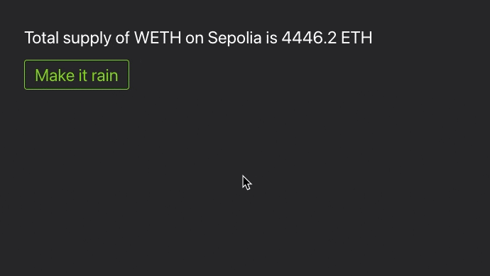

# Interactivity

If you don't want to limit your HTML to static content, you can make also make it interactive. You can add onClick handlers to buttons (without any JS) and create animations in CSS. Here is an example button (deployed at [0x11Cf5a6d842cC93353Cd9630a78f53AC5AA77b1A](https://monobase.xyz/sepolia/address/0x11Cf5a6d842cC93353Cd9630a78f53AC5AA77b1A/frontend) on Sepolia):



And the code for it is simple:

```Solidity
function getUI(address forAddress) public view override returns (string memory) {
    bytes memory makeItRainCall = abi.encodeCall(this.makeItRain, (forAddress));
    return string.concat(
    	getStyle(),
        "<div id=\"container\" style=\"background-color: #27272a; color: white; font-size: 24px; padding: 40px;\">",
    		"<div>Total supply of WETH on ", getChainString(), " is ", floatToString(thisContract.totalSupply(), 1 ether, 1), " ETH", "</div>",
    		"<button ui-post=\"/this/", bytesToString(makeItRainCall), "\" ui-target=\"#container\" ui-swap=\"beforeend\" class=\"button\" style=\"display: block; margin-top: 20px;\">",
    			"Make it rain",
    		"</button>",
        "</div>"
    );
}

function makeItRain(address forAddress) public view returns (string memory) {
	return string.concat(
		"<div style=\"display: flex; gap: 20px; font-size: 42px;\">",
			"<div style=\"animation: slideDown ease-in 2s 0s infinite;\">",
				unicode"💵",
			"</div>",
			"<div style=\"animation: slideDown ease-in 2s 0.7s infinite;\">",
				unicode"💶",
			"</div>",
			"<div style=\"animation: slideDown ease-in 2s 0.3s infinite;\">",
				unicode"💴",
			"</div>",
		"</div>"
	);
}

function getStyle() public pure returns (string memory) {
	return string.concat(
		"<style>",
			".button {",
				"border: 1px solid #7dc71b;",
				"color: #7dc71b;",
				"padding: 8px 14px;",
				"border-radius: 4px;",
			"}",
			".button:hover {",
    			"background-color: #7dc71b;",
				"color: black;",
  			"}",
			"@keyframes slideDown {",
  				"0% {",
    				"transform: translateY(0);",
  				"}",
  				"100% {",
    				"transform: translateY(230px);"
  				"}",
			"}",
		"</style>"
	);
}
```

As you can see no, JS is required! The logic is done using Solidity via a declarative approach in HTML.

- `ui-post` specifies which function to call when the button is clicked. This function should return a string with some HTML.
- `ui-target` specifies which DOM element to modify with the returned HTML from the above function.
- `ui-swap` specifies the swap behavior, i.e. how to reconcile the newly returned HTML with the target DOM element. In the example above, "beforeend" specifies that we should insert the newly returned HTML before the end of the DOM element with `id="container"`. For all available values of `ui-swap`, see [here](https://htmx.org/attributes/hx-swap/).

> _The link above takes you to the HTMX docs page but on-chain UI does not depend on HTMX in any way. We are just reusing some great ideas from the HTMX library. In the future, there will be proper docs for `ui-swap` that don't link to the HTMX page._
