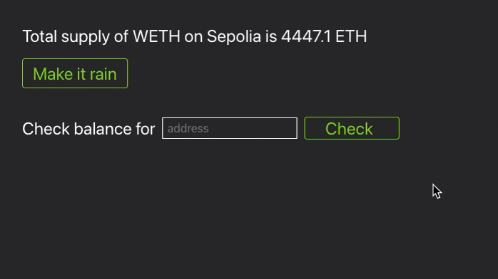

# User input

If you want to take user input, you just create simple `<form>` elements with `<input>` fields. There is also optional client-side and contract-side validation. Your contract will be able to access the values entered by the user. Here is an example (deployed at [0xd48842625ab7254aAD89a718484F303F3f379Cd7](https://monobase.xyz/sepolia/address/0xd48842625ab7254aAD89a718484F303F3f379Cd7/frontend) on Sepolia):



The code for the above is:

```Solidity
function getUI(address forAddress) public view override returns (string memory) {
    ...
    return string.concat(
        ...
    	"<form ui-post=\"/this/", bytesToString(abi.encodePacked(this.checkBalance.selector)), "$balanceAddress\" ui-target=\"#balance\" ui-swap=\"innerHTML\" style=\"margin-top: 40px; display: flex; gap: 10px; align-items: center;\">",
    		"<label for=\"balance-address\">Check balance for</label>",
    		"<input ",
    		  "type=\"address\" ",
    		  "name=\"balanceAddress\" ",
    		  "class=\"input\" ",
    		  "id=\"balance-address\" ",
    		  "placeholder=\"address\"/>",
        	"<button type=\"submit\" class=\"button center-children\" style=\"padding: 3px 14px 3px 28px;\">",
    			"Check", loadingSpinner(),
    		"</button>",
    	"</form>",
        ...
    );
}

function checkBalance(address forAddress) public view returns (string memory) {
	return string.concat(
		"<div>",
			"Balance is ", floatToString(thisContract.balanceOf(forAddress), 1 ether, 2), " ETH",
		"</div>"
	);
}
```

As you can see, you can access the values entered by the user with `$value-name` keyword. In the example above, we access the address using the `$balanceAddress` keyword where `balanceAddress` is the name of the `<input>` element.

Contract-side validation can be done by implementing a function that returns a boolean in your contract. TODO: create an example.
